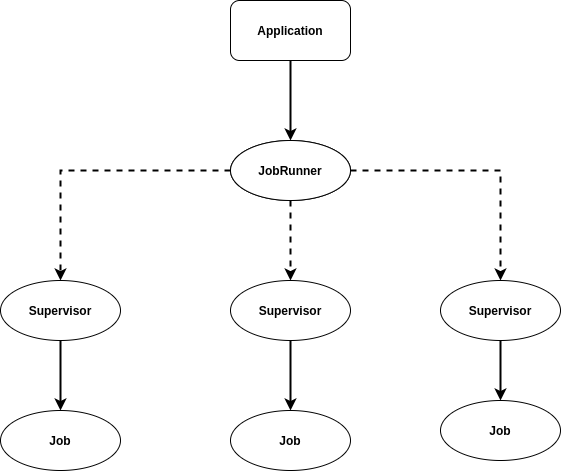

# Jobber

Job processsing system

This is the result of following the book _Concurrent Data Processing in Elixir Fast, Resilient Applications with OTP, GenStage, Flow, and Broadway_ by Svilen Gospodinov

This is how the supervision tree looks like:



## How to interact with this project

```Elixir
# run a job like this
GenServer.start(Jobber.Job, work: fn -> Process.sleep(5_000); {:ok, []} end)

# run a job that fails (it assumes you will only have 3 automatic retries)
GenServer.start(Jobber.Job, work: fn -> Process.sleep(5_000); :error end)
```

`Process.sleep(5_000)` is being used to pretend we're doing some time-consuming work.

There's a way of automate things more:

```Elixir
# try a good job
Jobber.start_job(work: good_job)

# or a bad job
Jobber.start_job(work: bad_job)

# this will raise an exception
Jobber.start_job(work: doomed_job)
```

You can see that the `DynamicSupervisor` will be restarted everytime an exception occurs.

If you want to retrieve the `DynamicSupervisor`'s process identifier, do this:

```Elixir
iex (1)> Process.whereis(Jobber.JobRunner)

iex (2)> Jobber.start_job(work: doomed_job)

# after some time do this
iex (3)> Process.whereis(Jobber.JobRunner)
```

You will see the identifier will be different because the supervisor was restarted because it was uncapable of restarting that process, **ensuring the reliability of the system**. In this case, it happens because the GenServer has `:transient` restarting strategy.
